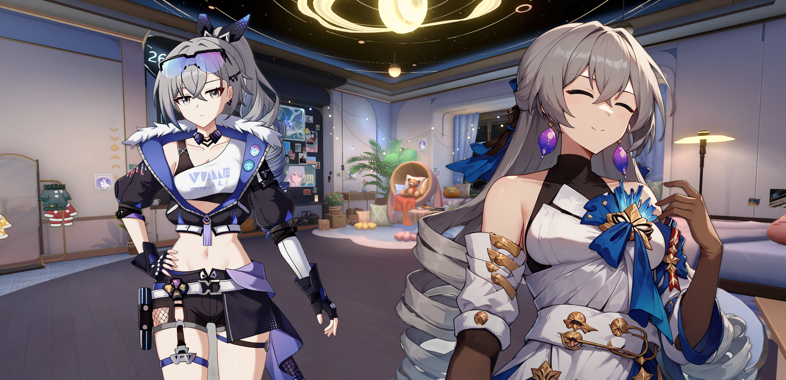
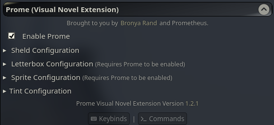

<a name="readme-top"></a>

![][cover]

<div align="center">

[English](README.md) | **Español**

</div>

El extensión de novela visual Prome es una extensión para SillyTavern que moderniza el sistema de novela visual, separándolo de ST y convirtiéndolo en una extensión.

## Porque Prome?

> Prometheus: _Boom..._

## Características

1. Facil integración con SillyTavern y su Modo Novela Visual.
2. Tinte de Mundo y/o Personaje - El mayor característica de Prome hasta hoy. ¿Quieres hacer un conversación en la tarde por esa 'cita especial' o experimentar una versión alterada de un mundo de videojuego, pero no puedes conseguir el clima o eventos que quieres (como un ciclo de día permanente en Honkai: Star Rail)? Ahora puedes ajustar los colores del mundo y/o de los personajes como **tú** quieras.

> [!NOTE]
> Las opciones de tinte disponibles son: Desenfoque, Brillo, Contraste, Escala de grises, Tono, Invertir, Saturar y Sepia. El Tinte del Mundo puede ser compartido con los personajes y ambos tintes pueden ser habilitados o deshabilitados en el menú de Prome.

   <center>
      
   </center>

3. **[BETA]** Sprites de Usuario - La segunda mayor característica de Prome. ¿Quieres ser parte de la conversación? Presta los sprites de otra persona/personaje o usa los tuyos mientras usas todas las otras características de Prome.

> [!IMPORTANT]
> 1. En raras ocasiones, SillyTavern puede mostrar una advertencia que dice _'prome-user' is not in the list of group members_ en un Grupo de Chat. Ignora esta advertencia ya que este es tu personaje y Prome ya lo ha añadido al grupo de chat.
> 2. Al cambiar de chat, puedes ver un personaje "quebrado" en la lista de personajes/grupos llamado `Prome User Sprite (Do Not Click)`. No interactúes con él ya que este es Prome creando un "personaje ficticio" para tu personaje en un grupo de chat. Sin embargo, puedes mover su posición a otro lugar en el grupo de chat.
> 3. Si decides usar el nombre de un personaje que existe en el grupo de chat o tu nombre de personaje es el mismo que un personaje en el chat, tu sprite de usuario *puede* cambiar expresiones al de dicho personaje. Esta es principalmente una limitación de ST pero siempre puedes revertirlo a través de `/express` o duplicando la carpeta del personaje y renombrándola a otra cosa.

   <center>
      
   </center>

4. Emulación de Sprites - ¿Alguna vez has querido hacer un grupo de chat con todos tus personajes favoritos pero hay un personaje que no puedes encontrar sprites? Con Emulación de Sprites, Prome le dirá a SillyTavern que use la imagen de la tarjeta de dicho personaje y lo incluya en el grupo de chat.

> [!NOTE]
> Emulación de Sprites solo funciona en chats de grupo o chats individuales con Sprites de Usuario activados.

   <center>
    
   </center>

5. Modo de Enfoque/Desenfoque - ¿Quieres replicar el enfoque de sprites de algunas novelas visuales como Doki Doki Literature Club? El Modo de Enfoque y/o Desenfoque de Personajes te da la habilidad de hacerlo dentro de tus chats, haciendo saber quién está hablando en cualquier momento.

> [!NOTE]
> La velocidad de la animación y la transición de Enfoque/Desenfoque de los Sprites de Personajes pueden ser ajustadas en el menú de Prome.

   <center>
    
   </center>

6. Esconder Sprites de Personajes Automáticamente (una alternativa a deshabilitar personajes) - ¿Quieres mantener a todos en el chat pero hay demasiadas personajes en pantalla para verlos(las) todos? Dale a Prome un límite de sprites para mostrar en la pantalla de la novela visual! Ya sea que quieras 3, 6 u 8 personajes, Prome esconderá automáticamente a cualquier personaje que no haya participado en la conversación, haciendo que la pantalla sea más fácil de ver.

   <center>
    
   </center>

7. Sombras y Temblor de Sprites (Emula Hablar) - ¿Quieres un poco más de "realismo" en tus sprites de personajes? Prome tiene la habilidad de imitar a un personaje hablando con un ligero temblor y añadir una sombra al sprite, haciendo que el personaje se mezcle más en el la escena que has elegido!

> [!IMPORTANT]
> El temblor de sprites solo funcionará si `Streaming` está habilitado en la configuración de tu preset. Las sombras de sprites pueden ser ajustadas en las distancias X y Y así como la fuerza de desenfoque.

   <center>
       
    </center>

8. Escalado de Sprites - ¿Tus sprites tienen una pequeña tendencia a salir de los límites del pantalla o tal vez son demasiado grandes? ¿O es lo contrario y son pequeños? Escalalos hacia arriba o hacia abajo como tu quieras!

> [!NOTE] 
> Este es un escalador global y afectará a todos los sprites en el chat (incluyendo Sprites de Usuario).

|                       Estándar (1.0)                      |                          Reducido (0.75)                         |
| :-------------------------------------------------------: | :-------------------------------------------------------------: | 
|  |  |

9. Modo Letterbox - Haz tu experiencia de novela visual más 'cinematográfica' o 'retro' con letterboxes del pasado!

> [!NOTE]
> Los letterboxes pueden ser renderizados horizontalmente o verticalmente y pueden ser ajustados en tamaño y color en el menú de Prome.

|                 Horizontal                  |                Vertical                 |
| :-----------------------------------------: | :-------------------------------------: |
|  |  |

10. Modo de Novela Visual Tradicional - ¿Quieres una experiencia de novela visual aún más tradicional de una respuesta a la vez? El Modo de Novela Visual Tradicional hará que Prome transforme la pantalla de novela visual de SillyTavern para comportarse de manera más similar a algunas novelas visuales como Katawa Shoujo o juegos tipo NVL (texto largo).

   <center>
    
    </center>

> [!TIP]
> Para ver el historial de chat con el Modo de Novela Visual Tradicional activado, haz clic en el ícono de varita y haz clic en _Abrir Historial de Chat_.

> 

11. Visibilidad de Sheld - Esconde el Sheld (Caja de Mensajes) para capturar el momento de un chat.

> [!NOTE]
> Esta característica puede ser activada en el menú de configuración o presionando `Ctrl` + `F1`.

   <center>
      
   </center>

La mayoría de las configuraciones de Prome se pueden encontrar en _Extensiones_ > `Prome (Extensión de Novela Visual)`. Otras características como el Historial de Chat estarán ubicadas bajo la herramienta de varita en el chat de ST.
| Configuraciones de Extensiones | Opciones de Varita |
| :-------------------------------------: | :---------------------------------------: |
|  |  |

## Requisitos

- SillyTavern 1.12.14+ 

## Installación

Prome tiene dos ramas para elegir:
1. `main` - La versión estable de Prome que funciona para todas las versiones de SillyTavern (a menos que staging rompa una dependencia de Prome).
2. `dev` - Básicamente una versión beta de Prome donde las cosas que planeo agregar/arreglar van antes de pasar a `main` o despues de un actualización de SillyTavern. Puede que no funcione completamente y las cosas pueden cambiar en cualquier momento.

> [!NOTE]
> Si estás instalando Prome a través de SillyTavern's *Download Extensions & Assets* o *Installar Extensión*, solo podrás usar la rama `main` de Prome. Si deseas usar la rama `dev` de Prome, consulta el método [Git](#via-git).

#### Via Download Extensions & Assets (Easiest)

1. Presiona _Extensiones_ y luego **Download Extensions & Assets**.
2. Haz clic en el botón de enchufe rojo y luego en OK.
3. Busca `Prome Visual Novel Extension` y haz clic en el botón de descarga.
4. Actualiza la página de SillyTavern de nuevo.
5. Haz clic en _Extensiones_ nuevamente y haz clic en la flecha hacia abajo en el menú desplegable `Prome (Extensión de Novela Visual)` y activa _Iniciar Prome_.
   > Si ya tienes el Modo Novela Visual activado, puedes omitir este paso.
6. Beneficio.

#### Via Instalar Extensión

1. Presiona _Extensiones_ y luego **Instalar Extensión**.
2. Pega el siguiente **enlace** en el campo de texto y haz clic en Guardar:

   ```
   https://github.com/Bronya-Rand/Prome-VN-Extension
   ```

3. Actualiza la página de SillyTavern.
4. Haz clic en _Extensiones_ nuevamente y haz clic en la flecha hacia abajo en el menú desplegable `Prome (Extensión de Novela Visual)` y activa _Iniciar Prome_.
   > Si ya tienes el Modo Novela Visual activado, puedes omitir este paso.
5. Beneficio.

#### Via Git
1. Ve a tu carpeta de extensiones (generalmente en `/data/default-user/extensions`).
2. Abre símbolo del sistema de Windows, Terminal, Windows Powershell, etc. y ejecuta el siguiente comando: 
   
   ```sh
   git clone https://github.com/Bronya-Rand/Prome-VN-Extension
   ```

> [!NOTE]
> Si deseas usar la rama `dev` de Prome, ejecuta este comando en su lugar:
> ```sh
> git clone https://github.com/Bronya-Rand/Prome-VN-Extension -b dev
> ```
3. Actualiza la página de SillyTavern o inicia SillyTavern (si no está activo).
4. Haz clic en _Extensiones_ nuevamente y haz clic en la flecha hacia abajo en el menú desplegable `Prome (Extensión de Novela Visual)` y activa _Iniciar Prome_.
   > Si ya tienes el Modo Novela Visual activado, puedes omitir este paso.
5. Beneficio.

El Prome Visual Novel Extension, el código de la extensión de novela visual Prome, Derechos de autor (c) 2024-2025 Bronya-Rand. Todos los derechos reservados.

<!-- LINK GROUP -->
[cover]: ./prome-open-graph.jpg