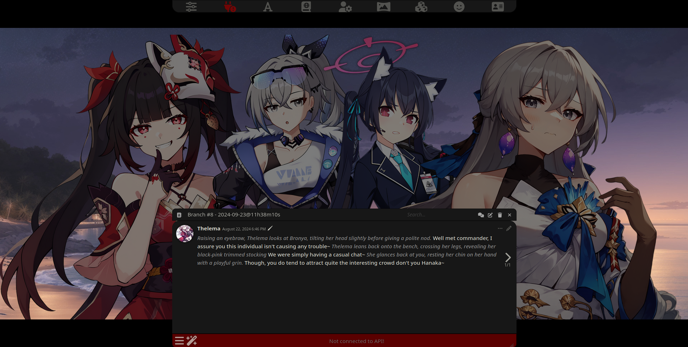

# Prome Visual Novel Extension

The Prome Visual Novel Extension is a extension for SillyTavern that remodernizes the Visual Novel system by separating it from ST itself into a extension.

## Why Prome?

> Prometheus: Boom...

## Features

1. Easy integration with ST's VN Mode.
2. Letterbox Mode - Make your VN experience more 'cinematic.'

   > This feature can be toggled to be horizontal or vertical and can be adjusted in size and color as needed.

   |                 Horizontal                  |                Vertical                 |
   | :-----------------------------------------: | :-------------------------------------: |
   |  |  |

3. Sheld Visibility - Hide the Sheld (Message Box) to capture the moment of a given chat.
   > This feature can be toggled in the Settings Menu or by pressing _Ctrl+F1_.
   

    
   

4. Focus Mode - Focuses the speaking character sprite in chat with different animations and animation speed.
   > This feature is only supported in a Group Chat VN.
   

    
   

5. Defocus Mode - Similar to Focus Mode, but focuses primarily on making the focused sprite more noticeable by darkening other characters (works alongside Focus Mode).
   > This feature is only supported in a Group Chat VN.
   

    
   

6. [BETA] Traditional VN Mode - Hides all messages that isn't the last message to make the chat more akin to a normal VN response prompt.
   

    
    

All features and it's settings can be found under 'Extensions > Prome (Visual Novel Extension)'.

   

    
   

## Prerequisites

A SillyTavern that supports extensions.

## Installation and Usage

### Installation

1. Click _Extensions_ then **Install Extension**
2. Paste in the following **link** into the text field and click Save: `https://github.com/Bronya-Rand/Bronie-Parser-Extension`.
3. Click down on the `Prome (Visual Novel Extension)` dropdown and toggle _Enable Prome VN Mode_.
   > If you already have Visual Novel Mode on, you can skip this step.
4. Profit.
