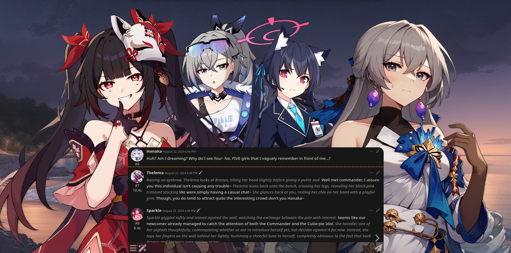
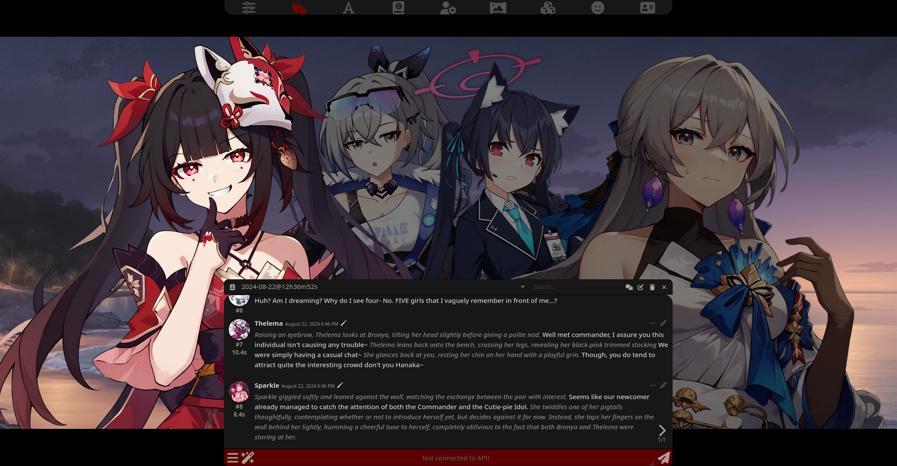
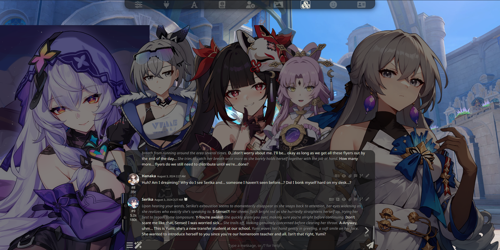

# Prome Visual Novel Extension

The Prome Visual Novel Extension is a extension for SillyTavern that remodernizes the Visual Novel system by separating it from ST itself into a extension.

## Why Prome?

> Prometheus: _Boom..._

## Features

1. Easy integration with ST's VN Mode.
2. Letterbox Mode - Make your VN experience more 'cinematic.'

   > This feature can be toggled to be horizontal or vertical and can be adjusted in size and color as needed.

   |                 Horizontal                  |                Vertical                 |
   | :-----------------------------------------: | :-------------------------------------: |
   |  |  |

3. Sheld Visibility - Hide the Sheld (Message Box) to capture the moment of a given chat.
   > This feature can be toggled in the Settings Menu or by pressing `Ctrl` + `F1`.
   

    
   

4. Focus Mode - Focuses the speaking character sprite in chat with different animations and animation speed.
   > This feature is only supported in a Group Chat VN.
   

    
   

5. Darken Character Sprites - Similar to Focus Mode, but focuses primarily on making the focused sprite more noticeable by darkening other characters.
   > This feature is only supported in a Group Chat VN. This feature also works alongside `Focus Mode` itself.
   

    
   

6. Traditional VN Mode - Hides all messages that isn't the last message to make the chat more akin to a normal VN response prompt.
   

    
    

7. Chat History (for Traditional VN Mode) - Since Traditional VN hides all messages but the last sent message, a wand button has been added to view said chat history.
   > This feature is obsolete if you don't use VN Mode, but can be accessed regardless via the Wand Icon -> Open Chat History.
   

    
   

8. Sprite Emulation - Emulates Sprites by using a character's character card.
   > TBH, I have no idea what use case this has, but someone asked for it.
   

    
   

9. Sprite Shake - Shakes the speaking character sprite when they are speaking.
   > This feature only works if `Streaming` is enabled in your preset settings.
10. Sprite Shadows - Adds a small shadow to the character sprites, making them blend in with the environment or to add a small glint of realism to the chat.
    > This feature can be adjusted in size (X and Y) and blur strength. This feature does not work for non-sprite characters using Sprite Emulation.
    

       
    

11. [BETA] World + Character Tinting - Prome's biggest feature to date. Tints the background and/or characters to a given preset of your choice.
    > This is in beta. Tinting choices are: Blur, Brightness, Contrast, Grayscale, Hue, Invert, Saturate and Sepia. World Tint may be shared with Character Tint and both tints can be enabled or disabled.
    

       
    

Most features and it's settings can be found under _Extensions_ > `Prome (Visual Novel Extension)`. Other features like Chat History will be located under the wand tool in the ST chatbox.

|           Extension Settings            |               Wand Options                |
| :-------------------------------------: | :---------------------------------------: |
|  |  |

## Prerequisites

A SillyTavern that supports extensions.

## Installation and Usage

### Installation

#### Via Download Extensions & Assets (Easiest)

1. Click _Extensions_ then **Download Extensions & Assets**
2. Click the red power plug button and then OK.
3. Scroll down to find `Prome Visual Novel Extension` and click the Download button.
4. Refresh the SillyTavern page.
5. Click on _Extensions_ again and click down on the `Prome (Visual Novel Extension)` dropdown and toggle _Enable Prome VN Mode_.
   > If you already have Visual Novel Mode on, you can skip this step.
6. Profit.

#### Via Install Extension

1. Click _Extensions_ then **Install Extension**
2. Paste in the following **link** into the text field and click Save: `https://github.com/Bronya-Rand/Prome-VN-Extension`.
3. Refresh the SillyTavern page.
4. Click on _Extensions_ again and click down on the `Prome (Visual Novel Extension)` dropdown and toggle _Enable Prome VN Mode_.
   > If you already have Visual Novel Mode on, you can skip this step.
5. Profit.
