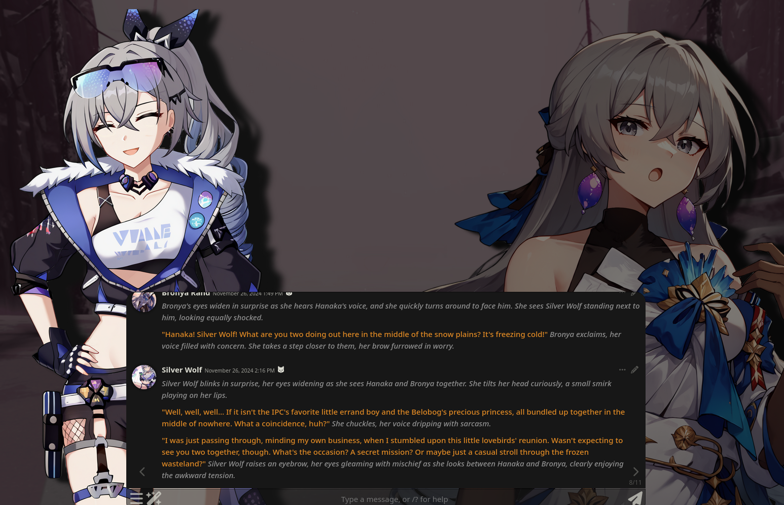
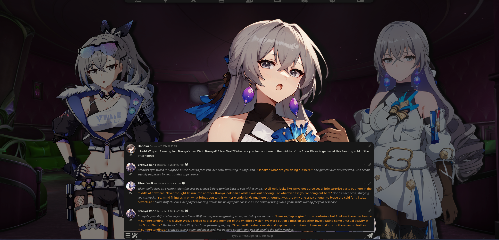
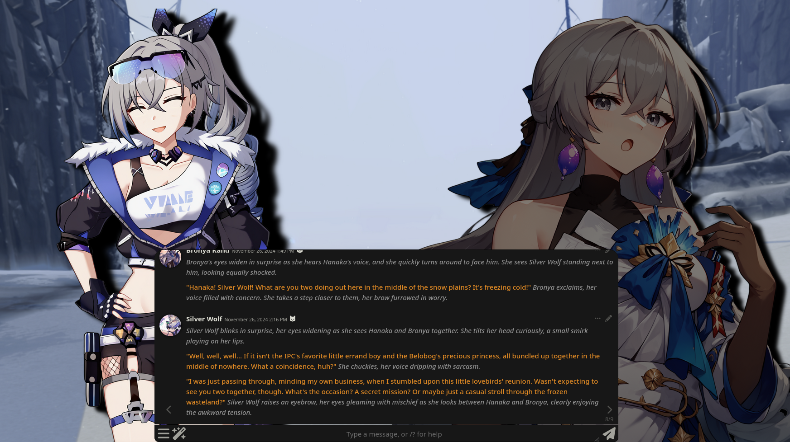
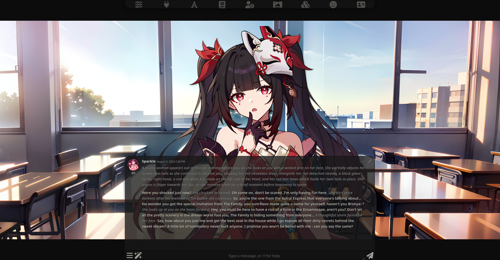
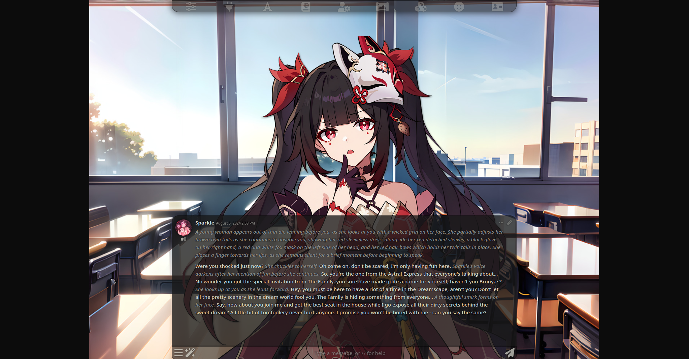
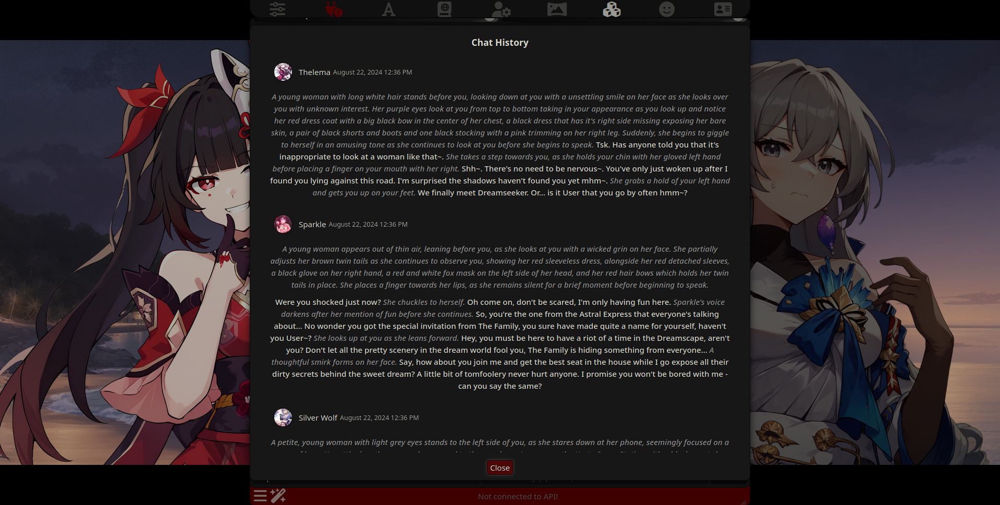
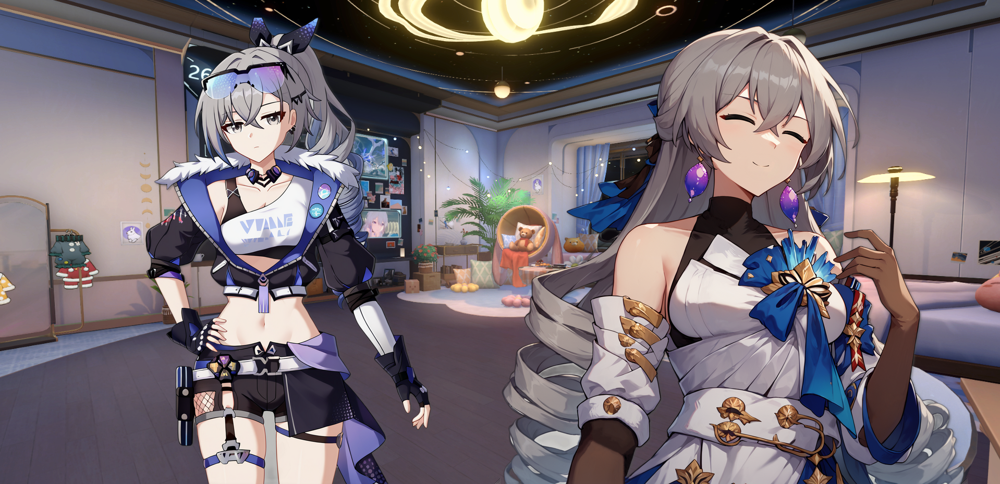
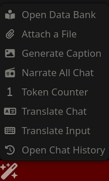

# Prome Visual Novel Extension

The Prome Visual Novel Extension is a extension for SillyTavern that remodernizes the Visual Novel system by separating it from ST itself into a extension.

## Why Prome?

> Prometheus: _Boom..._

## Features

1. Easy integration with SillyTavern and it's Visual Novel Mode
2. **[BETA]** World + Character Tinting - Prome's biggest feature to date. Wanted to make a chat take place in the evening for that special 'date' or experience a post-alter version of a game world, but were unable to get such weather/events to happen (such as a locked day cycle in Honkai: Star Rail)? Now you can by setting the world and/or character colors to be how **YOU** want it to be.
   > [!TIP]
   > Tinting choices available are: Blur, Brightness, Contrast, Grayscale, Hue, Invert, Saturate and Sepia. The World Tint can be shared with characters and both tints can be enabled or disabled in the Prome menu.
   

      
   

3. **[BETA]** User Sprites - Prome's second biggest feature. Want to be part of the conversation? Borrow someone else's sprites or use your own for your own persona whilst using all of Prome's other features!

   > [!WARNING]
   > There is a possibility that SillyTavern may display a warning saying _'prome-user' is not in the list of group members_ in a Group Chat. Ignore this warning as this is your persona and Prome has already added it to the group chat.

   > [!IMPORTANT]
   > When changing chats, you might spot a "broken" character in the character/group list. Do not interact with it as this is Prome making a "dummy character" for your persona to use in a group chat. You can however move it's position to be elsewhere in a group chat.

   

      
   

4. Sprite Emulation - Ever wanted to make a group chat of all your favorite characters but there is that one character who you can't find sprites for? With Sprite Emulation, Prome will just tell SillyTavern to use said character's character card and include them in the group chat!
   

    
   

5. Focus/Defocus Mode - Want to replicate the sprite focus of some visual novels like Doki Doki Literature Club. Focus Mode/Darken Character Sprites gives you the ability to do so within your chats, making it known who is speaking at any given moment.
   

    
   

6. Sprite Shadows & Shake (Emulates Speaking) - Wanted a bit more "realism" to your character sprites? Prome has the ability to mimic a character talking by shaking the sprite subtly and add a shadow to the sprite itself, making the character blend in more into the environment you've chosen!
   > [!IMPORTANT]
   > These features will not work on emulated sprite characters. Sprite Shake will only work if `Streaming` is enabled in your preset settings. Sprite Shadows can be adjusted in X and Y distances as well as blur strength.
   

       
    

7. Letterbox Mode - Make your VN experience more 'cinematic' or 'retro' with letterboxes of the past!

   > [!TIP]
   > Letterboxes can be rendered horizontalally or vertically and can be adjusted in size and color in the Prome menu.

   |                 Horizontal                  |                Vertical                 |
   | :-----------------------------------------: | :-------------------------------------: |
   |  |  |

8. Traditional VN Mode - Want a even further visual novel experience of one reply at a time? Enabling Traditional VN Mode will make Prome transform the SillyTavern VN screen to behave more similarly to some Visual Novels like Katawa Shoujo or NVL (long text) type games.
   

    
    

   > [!TIP]
   > To view chat history with Traditional VN Mode on, click on the Wand Icon and click _Open Chat History_.
   > 

9. Sheld Visibility - Hide the Sheld (Message Box) to capture the moment of a given chat.
   > [!TIP]
   > This feature can be toggled in the Settings Menu or by pressing `Ctrl` + `F1`.
   

    
   

> [!TIP]
> Most of Prome's feature settings can be found under _Extensions_ > `Prome (Visual Novel Extension)`. Other features like Chat History will be located under the wand tool in the ST chatbox.
> | Extension Settings | Wand Options |
> | :-------------------------------------: | :---------------------------------------: |
> |  |  |

## Prerequisites

A SillyTavern that supports extensions.

## Installation and Usage

### Installation

#### Via Download Extensions & Assets (Easiest)

1. Click _Extensions_ then **Download Extensions & Assets**
2. Click the red power plug button and then OK.
3. Scroll down to find `Prome Visual Novel Extension` and click the Download button.
4. Refresh the SillyTavern page.
5. Click on _Extensions_ again and click down on the `Prome (Visual Novel Extension)` dropdown and toggle _Enable Prome VN Mode_.
   > If you already have Visual Novel Mode on, you can skip this step.
6. Profit.

#### Via Install Extension

1. Click _Extensions_ then **Install Extension**
2. Paste in the following **link** into the text field and click Save: `https://github.com/Bronya-Rand/Prome-VN-Extension`.
3. Refresh the SillyTavern page.
4. Click on _Extensions_ again and click down on the `Prome (Visual Novel Extension)` dropdown and toggle _Enable Prome VN Mode_.
   > If you already have Visual Novel Mode on, you can skip this step.
5. Profit.
