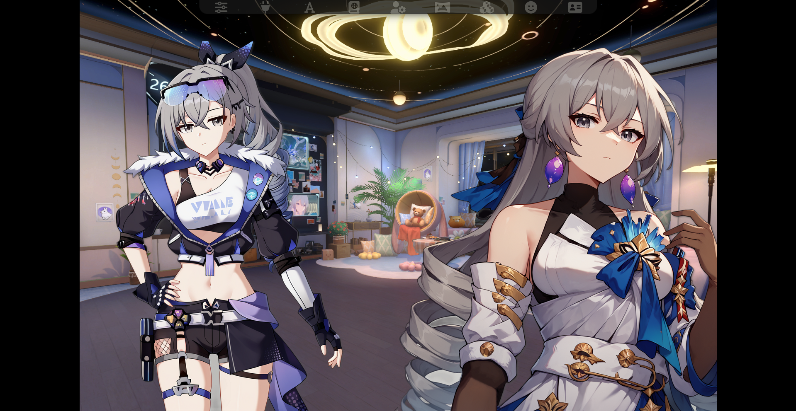

# Prome Visual Novel Extension

The Prome Visual Novel Extension is a extension for SillyTavern that remodernizes the Visual Novel system by separating it from ST itself into a extension.

## Why Prome?
> Prometheus: Boom...

## Previews

| Horizontal | Vertical |
| :--------: | :------: |
|  |  | 

## Features

1. Same features as the original VN mode.
2. Letterbox Mode - Make your VN experience more 'cinematic.'
   > This feature can be toggled to be horizontal, vertical or none at all. It can be size and color adjusted as needed.
   

    
   

## Prerequisites

A SillyTavern that supports extensions.

## Installation and Usage

### Installation

1. Click _Extensions_ then **Install Extension**
2. Paste in the following **link** into the text field and click Save: `https://github.com/Bronya-Rand/Bronie-Parser-Extension`.
3. Click down on the `Prome (Visual Novel Extension)` dropdown and toggle *Enable Prome VN Mode*.
   > If you already have Visual Novel Mode on, you can skip this step.
4. Profit.

